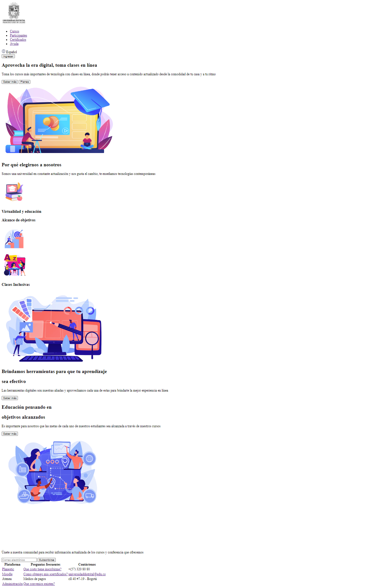
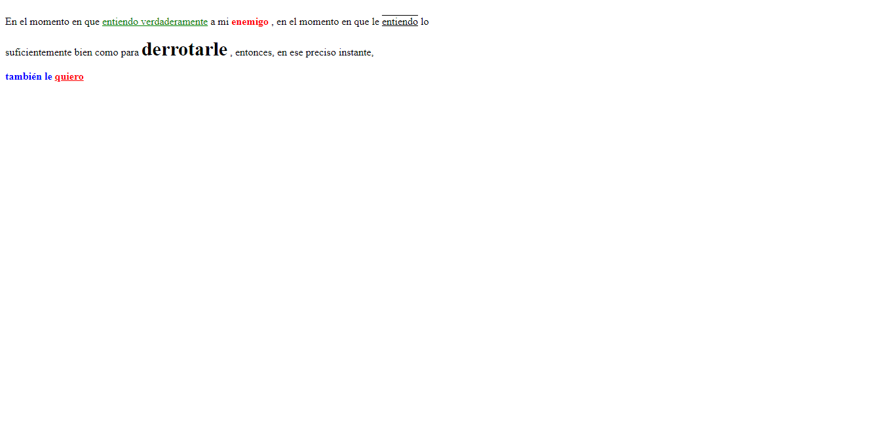

<h1>Taller 9: Ingrid Dayana Polanco Sierra</h1>
<h2>Información</h2>

Curso: Full Stack Básico - Grupo 1

Profesor: Cristian Patiño

<h2>Punto 1: Link de figma</h2>
<a href="https://www.figma.com/file/tnIl9xOkTwLY6M2iAFbaSC/Ingrid-Dayana-Polanco-Sierra---Figma-Excercise?type=design&node-id=0%3A1&t=xoP8uK91767GTJvD-1"> Link de Figma</a>

<h2>Punto 2: HTML</h2>

<h2>Punto 3: CSS</h2>

<h2>Punto 4: Text</h2>

<h2>Punto 5: Paragraph</h2>

